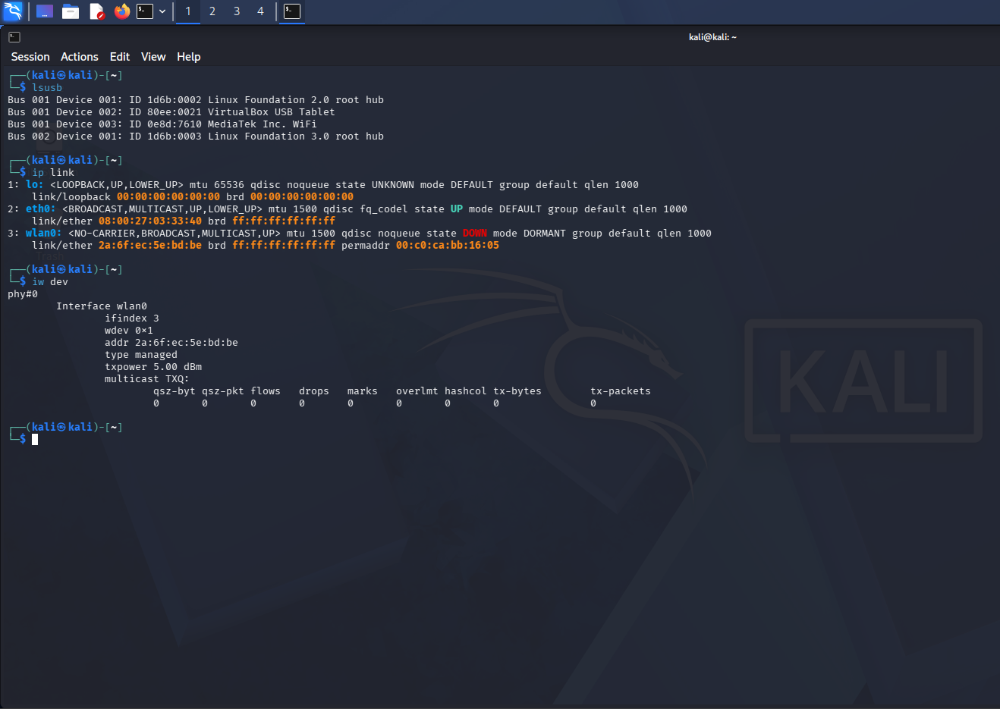
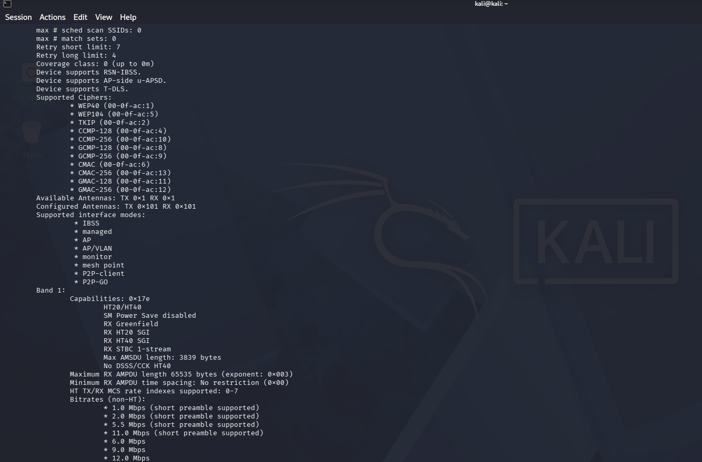
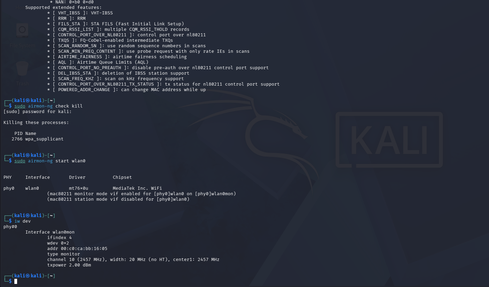
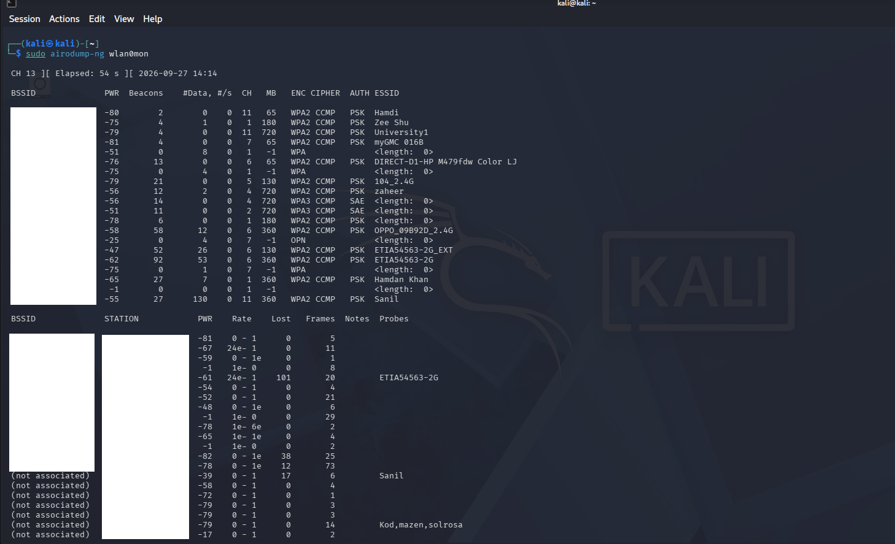
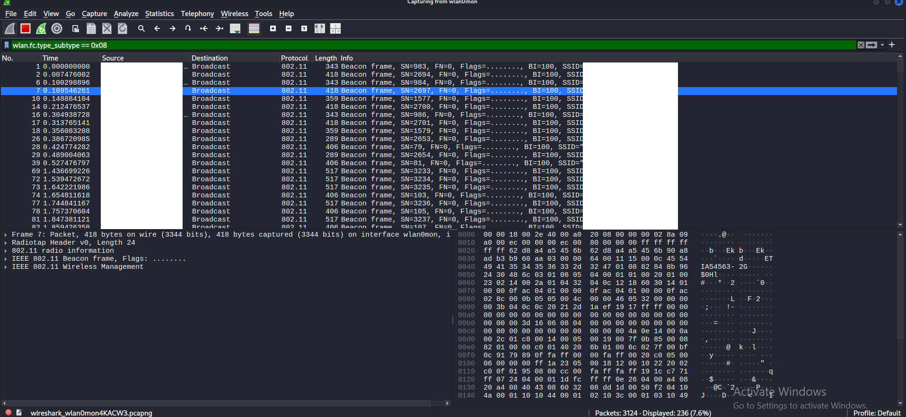
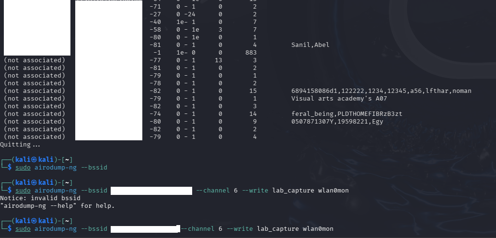
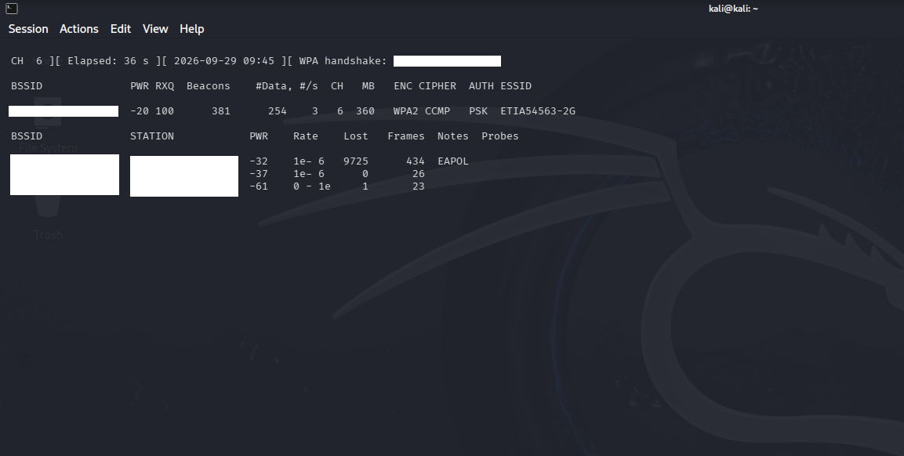
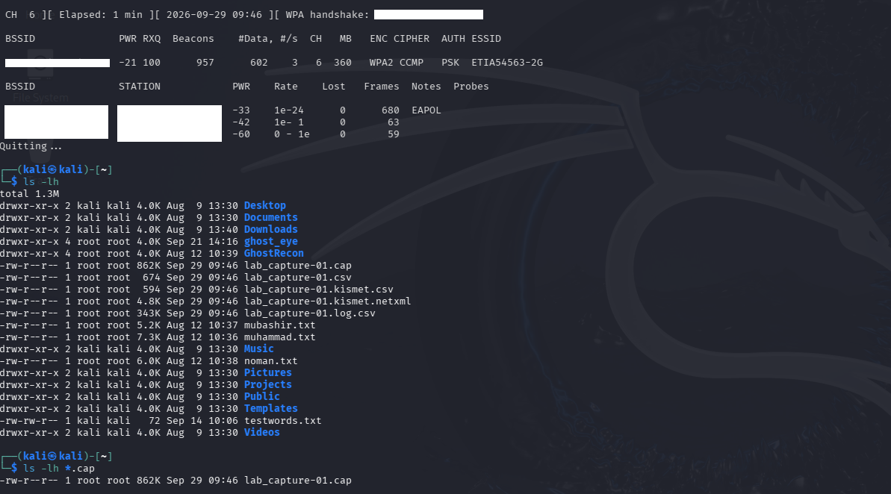
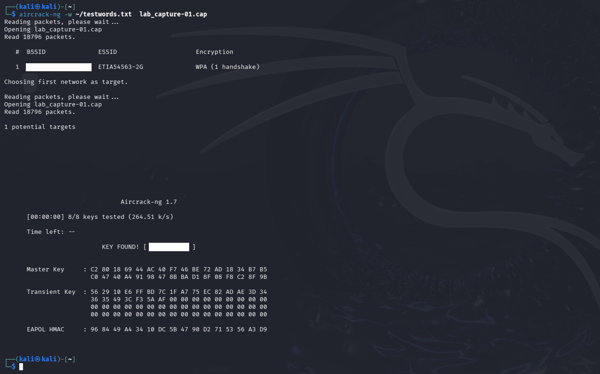

# Wireless Security Assessment Using Kali Linux

## Overview

This project demonstrates an authorized wireless security assessment performed in a controlled laboratory environment.

The assessment focuses on IEEE 802.11 wireless reconnaissance, monitor-mode configuration, packet analysis, WPA2 authentication handshake capture, and controlled password-strength assessment.

## Objectives

- Configure and verify an external wireless adapter
- Enable monitor mode
- Perform wireless network discovery
- Analyse IEEE 802.11 management frames
- Identify an authorized test wireless network
- Capture a WPA2 authentication handshake
- Verify the captured handshake
- Perform a controlled password-strength assessment
- Document security findings
- Provide wireless security recommendations

## Lab Environment

| Component | Technology |
|---|---|
| Operating System | Kali Linux |
| Wireless Adapter | Alfa AWUS036ACHM |
| Wireless Discovery | Airodump-ng |
| Packet Analysis | Wireshark |
| Password Assessment | Aircrack-ng |
| Virtualization | VirtualBox |
| Target | Authorized test wireless network |

## Methodology

The assessment followed these stages:

1. Wireless adapter detection
2. Monitor-mode capability verification
3. Monitor-mode configuration
4. Wireless network discovery
5. IEEE 802.11 beacon analysis
6. Authorized target identification
7. Targeted wireless monitoring
8. WPA2 handshake capture
9. Handshake verification
10. Controlled password-strength assessment
11. Findings and analysis
12. Security recommendations

## 1. Wireless Adapter Detection

The Alfa AWUS036ACHM wireless adapter was identified and verified within the Kali Linux environment.

## 2. Monitor Mode Capability

The wireless adapter was checked to confirm support for monitor mode.

## 3. Monitor Mode Configuration

The adapter was configured for monitor mode and the resulting wireless interface was verified.

## 4. Wireless Network Discovery

Airodump-ng was used to observe wireless networks within the authorized laboratory environment.

## 5. IEEE 802.11 Beacon Analysis

Wireshark was used to analyse IEEE 802.11 beacon frames and examine wireless network advertisement information.

## 6. Authorized Test Network Identification

The authorized laboratory wireless network was identified for subsequent controlled testing.

## 7. WPA2 Handshake Capture

The authorized test network was monitored while a test client associated with the access point. The resulting WPA2 authentication exchange was captured for analysis.

## 8. Handshake Verification

The captured authentication material was verified before proceeding with the controlled password-strength assessment.

## 9. Password Strength Assessment

A controlled dictionary-based assessment was performed against the authorized test network using a non-sensitive test wordlist.

## Findings

The assessment demonstrated the importance of strong wireless passphrases when using WPA2-PSK authentication. A weak or predictable passphrase can increase exposure to offline password-guessing attacks if authentication material is obtained.

## Security Recommendations

- Use a long and unique wireless passphrase.
- Avoid dictionary words and predictable patterns.
- Use WPA3 where supported.
- Keep wireless access-point firmware updated.
- Disable legacy and insecure wireless security protocols.
- Regularly review connected devices.
- Use a separate guest network for untrusted devices.

## Tools Used

- Kali Linux
- Alfa AWUS036ACHM
- Airodump-ng
- Aircrack-ng
- Wireshark
- VirtualBox

## Disclaimer

This project was conducted in a controlled and authorized laboratory environment for educational and cybersecurity learning purposes.

No unauthorized networks or systems were intentionally targeted.
